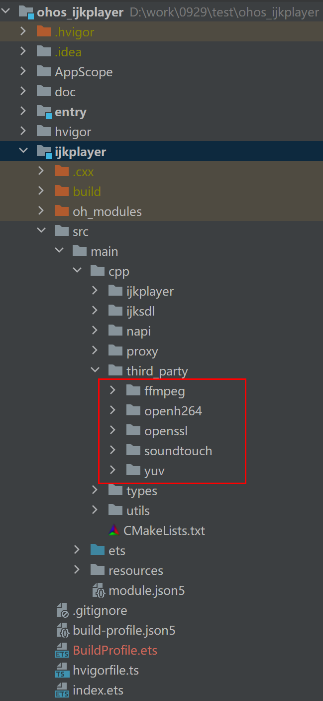

# ijkplayer

## 简介
>  ijkplayer是OpenHarmony环境下可用的一款基于FFmpeg的视频播放器。

## 演示


## 编译运行

### ffmpeg soundtouch yuv依赖
1. 修改编译之前需要在交叉编译中支持编译x86_64架构，可以参考[adpater_architecture.md](https://gitee.com/openharmony-sig/tpc_c_cplusplus/blob/master/docs/adpater_architecture.md)文档。

2. FFmpeg:基于B站的FFmpeg版本(ff4.0--ijk0.8.8--20210426--001):[FFmpeg源码链接](https://github.com/bilibili/FFmpeg/tags)， [FFmpeg](https://gitee.com/openharmony-sig/tpc_c_cplusplus/tree/master/thirdparty/FFmpeg-ff4.0)可以在交叉编译出库文件和头文件，编译可参考[FFmpeg-ff4.0编译指导](https://gitee.com/openharmony-sig/tpc_c_cplusplus/blob/master/thirdparty/FFmpeg-ff4.0/README_zh.md)。

   1. 注意编译FFmpeg-ff4.0的时候依赖的openssl使用OpenSSL_1_1_1w

   2. 编译之前需要先修改下面HPKBUILD文件中[openssl](https://gitee.com/openharmony-sig/tpc_c_cplusplus/tree/master/thirdparty/openssl)的版本

      ```shell
      pkgver=OpenSSL_1_1_1t 
      //修改为
      pkgver=OpenSSL_1_1_1w
      ```

   3. 下载openssl的[OpenSSL_1_1_1w版本](https://github.com/openssl/openssl/archive/refs/tags/OpenSSL_1_1_1w.tar.gz)，执行以下命令获取对应的sha512值，替换SHA512SUM文件的内容。

      ```shell
      sha512num openssl-OpenSSL_1_1_1w.tar.gz
      ```

   4. 编译最后会在lycium\usr生成FFmpeg-ff4.0文件夹改名为ffmpeg。

3. soudtouch:基于B站的soudtouch版本(ijk-r0.1.2-dev):[soundtouch源码链接](https://github.com/bilibili/soundtouch/branches) ，soundtouch须在交叉编译出库文件和头文件。

   1. 把doc目录下的soundtouch-ijk文件夹拷贝到thirdparty下在lycium文件夹执行./build.sh soundtouch-ijk可以在lycium\usr目录下编译出soundtouch的静态库和头文件

4. yuv:基于B站的yuv版本(ijk-r0.2.1-dev):[yuv源码链接](https://github.com/bilibili/libyuv/branches)，yuv须在交叉编译出库文件和头文件。
   1. 把doc目录下的libyuv-ijk文件夹拷贝到thirdparty下在lycium文件夹执行./build.sh libyuv-ijk可以在lycium\usr目录下编译出yuv的静态库和头文件

5. 把编译生成的openssl、ffmpeg、soundtouch、yuv的文件夹，覆盖到工程的ijkplayer/src/main/cpp/thirdparty下，如图所示：



### IDE编译运行

1、通过IDE工具下载依赖SDK，Tools->SDK Manager->OpenHarmony SDK 把native选项勾上下载，API版本>=9

2、开发板选择RK3568，[ROM下载地址](http://ci.openharmony.cn/workbench/cicd/dailybuild/dailylist). 选择开发板类型是rk3568，请使用最新的版本

3、使用git clone下载源码，不要直接通过gitee网页的方式下载

## 下载安装
```shell
ohpm install @ohos/ijkplayer
```
## 使用说明
```
   import { IjkMediaPlayer } from "@ohos/ijkplayer";
   import type { OnPreparedListener } from "@ohos/ijkplayer";
   import type { OnVideoSizeChangedListener } from "@ohos/ijkplayer";
   import type { OnCompletionListener } from "@ohos/ijkplayer";
   import type { OnBufferingUpdateListener } from "@ohos/ijkplayer";
   import type { OnErrorListener } from "@ohos/ijkplayer";
   import type { OnInfoListener } from "@ohos/ijkplayer";
   import type { OnSeekCompleteListener } from "@ohos/ijkplayer";
   import { LogUtils } from "@ohos/ijkplayer";
```
### 在UI中配置XComponent控件
```
    XComponent({
      id: 'xcomponentId',
      type: 'surface',
      libraryname: 'ijkplayer_napi'
    })
    .onLoad((context) => {
      this.initDelayPlay(context);
     })
     .onDestroy(() => {
     })
     .width('100%')
     .aspectRatio(this.aspRatio)
```

### 播放
```
    let mIjkMediaPlayer = IjkMediaPlayer.getInstance();
    // 设置XComponent回调的context
    mIjkMediaPlayer.setContext(this.mContext);
    // 设置debug模式
    mIjkMediaPlayer.setDebug(true);
    // 初始化配置
    mIjkMediaPlayer.native_setup();
    // 设置视频源
    mIjkMediaPlayer.setDataSource(url); 
    // 设置视频源http请求头
    let headers =  new Map([
      ["user_agent", "Mozilla/5.0 BiliDroid/7.30.0 (bbcallen@gmail.com)"],
      ["referer", "https://www.bilibili.com"]
    ]);
    mIjkMediaPlayer.setDataSourceHeader(headers);
    // 使用精确寻帧 例如，拖动播放后，会寻找最近的关键帧进行播放，很有可能关键帧的位置不是拖动后的位置，而是较前的位置.可以设置这个参数来解决问题
    mIjkMediaPlayer.setOption(IjkMediaPlayer.OPT_CATEGORY_PLAYER, "enable-accurate-seek", "1");
    // 预读数据的缓冲区大小
    mIjkMediaPlayer.setOption(IjkMediaPlayer.OPT_CATEGORY_PLAYER, "max-buffer-size", "102400");
    // 停止预读的最小帧数
    mIjkMediaPlayer.setOption(IjkMediaPlayer.OPT_CATEGORY_PLAYER, "min-frames", "100");
    // 启动预加载
    mIjkMediaPlayer.setOption(IjkMediaPlayer.OPT_CATEGORY_PLAYER, "start-on-prepared", "1");
    // 设置无缓冲，这是播放器的缓冲区，有数据就播放
    mIjkMediaPlayer.setOption(IjkMediaPlayer.OPT_CATEGORY_PLAYER, "packet-buffering", "0");
    // 跳帧处理,放CPU处理较慢时，进行跳帧处理，保证播放流程，画面和声音同步
    mIjkMediaPlayer.setOption(IjkMediaPlayer.OPT_CATEGORY_PLAYER, "framedrop", "5");
    // 最大缓冲cache是3s， 有时候网络波动，会突然在短时间内收到好几秒的数据
    // 因此需要播放器丢包，才不会累积延时
    // 这个和第三个参数packet-buffering无关。
    mIjkMediaPlayer.setOption(IjkMediaPlayer.OPT_CATEGORY_PLAYER, "max_cached_duration", "3000");
    // 无限制收流
    mIjkMediaPlayer.setOption(IjkMediaPlayer.OPT_CATEGORY_PLAYER, "infbuf", "1");
    // 屏幕常亮
    mIjkMediaPlayer.setScreenOnWhilePlaying(true);
    // 设置超时
    mIjkMediaPlayer.setOption(IjkMediaPlayer.OPT_CATEGORY_FORMAT, "timeout", "10000000");
    mIjkMediaPlayer.setOption(IjkMediaPlayer.OPT_CATEGORY_FORMAT, "connect_timeout", "10000000");
    mIjkMediaPlayer.setOption(IjkMediaPlayer.OPT_CATEGORY_FORMAT, "listen_timeout", "10000000");
    mIjkMediaPlayer.setOption(IjkMediaPlayer.OPT_CATEGORY_FORMAT, "addrinfo_timeout", "10000000");
    mIjkMediaPlayer.setOption(IjkMediaPlayer.OPT_CATEGORY_FORMAT, "dns_cache_timeout", "10000000");
    
    let mOnVideoSizeChangedListener: OnVideoSizeChangedListener = {
      onVideoSizeChanged(width: number, height: number, sar_num: number, sar_den: number) {
        that.aspRatio = width / height;
        LogUtils.getInstance()
          .LOGI("setOnVideoSizeChangedListener-->go:" + width + "," + height + "," + sar_num + "," + sar_den)
        that.hideLoadIng();
      }
    }
    mIjkMediaPlayer.setOnVideoSizeChangedListener(mOnVideoSizeChangedListener);
    let mOnPreparedListener: OnPreparedListener = {
      onPrepared() {
        LogUtils.getInstance().LOGI("setOnPreparedListener-->go");
      }
    }
    mIjkMediaPlayer.setOnPreparedListener(mOnPreparedListener);

    let mOnCompletionListener: OnCompletionListener = {
      onCompletion() {
        LogUtils.getInstance().LOGI("OnCompletionListener-->go")
        that.currentTime = that.stringForTime(mIjkMediaPlayer.getDuration());
        that.progressValue = PROGRESS_MAX_VALUE;
        that.stop();
      }
    }
    mIjkMediaPlayer.setOnCompletionListener(mOnCompletionListener);

    let mOnBufferingUpdateListener: OnBufferingUpdateListener = {
      onBufferingUpdate(percent: number) {
        LogUtils.getInstance().LOGI("OnBufferingUpdateListener-->go:" + percent)
      }
    }
    mIjkMediaPlayer.setOnBufferingUpdateListener(mOnBufferingUpdateListener);

    let mOnSeekCompleteListener: OnSeekCompleteListener = {
      onSeekComplete() {
        LogUtils.getInstance().LOGI("OnSeekCompleteListener-->go")
        that.startPlayOrResumePlay();
      }
    }
    mIjkMediaPlayer.setOnSeekCompleteListener(mOnSeekCompleteListener);

    let mOnInfoListener: OnInfoListener = {
      onInfo(what: number, extra: number) {
        LogUtils.getInstance().LOGI("OnInfoListener-->go:" + what + "===" + extra)
      }
    }
    mIjkMediaPlayer.setOnInfoListener(mOnInfoListener);

    let mOnErrorListener: OnErrorListener = {
      onError(what: number, extra: number) {
        LogUtils.getInstance().LOGI("OnErrorListener-->go:" + what + "===" + extra)
        that.hideLoadIng();
        prompt.showToast({
          message:"亲，视频播放异常，系统开小差咯"
        });
      }
    }
    mIjkMediaPlayer.setOnErrorListener(mOnErrorListener);

    mIjkMediaPlayer.setMessageListener();

    mIjkMediaPlayer.prepareAsync();

    mIjkMediaPlayer.start();
```
### 暂停
```
   mIjkMediaPlayer.pause();
```
### 停止
```
   mIjkMediaPlayer.stop();
```
### 重置
```
   mIjkMediaPlayer.reset();
```
### 释放
```
   mIjkMediaPlayer.release();
```
### 快进、后退
```
   mIjkMediaPlayer.seekTo(msec);
```
### 倍数播放
```
   mIjkMediaPlayer.setOption(IjkMediaPlayer.OPT_CATEGORY_PLAYER, "soundtouch", "1");
   mIjkMediaPlayer.setSpeed("2f");
```
### 屏幕常亮
```
   mIjkMediaPlayer.setScreenOnWhilePlaying(true);
```
### 循环播放
```
   mIjkMediaPlayer.setLoopCount(true);
```
### 设置音量
```
   mIjkMediaPlayer.setVolume(leftVolume, rightVolume);
```

## 接口说明

### IjkMediaPlayer.getInstance()
| 接口名                            | 参数                                          | 返回值             | 说明                     |
|--------------------------------|---------------------------------------------| ----------------- |------------------------|
| setContext                     | context: object                             | void              | 设置XComponent回调的context |
| setDebug                       | open: boolean                               | void              | 设置日志开关                 |
| native_setup                   | 无                                           | void              | 初始化配置                  |
| setDataSource                  | url: string                                 | void               | 设置视频源地址                |
| setDataSourceHeader            | headers: Map<string, string>                | void            | 设置视频源的HTTP请求头          |
| setOption                      | category:string, key: string, value: string | void | 设置播放前预设参数              |
| setOptionLong                  | category:string, key: string, value: string | void | 设置播放前预设参数              |
| prepareAsync                   | 无                                           | void              | 加载视频                   |
| start                          | 无                                           | void              | 播放视频                   |
| stop                           | 无                                           | void              | 停止播放                   |
| pause                          | 无                                           | void              | 暂停播放                   |
| reset                          | 无                                           | void              | 视频重置                   | 
| release                        | 无                                           | void              | 释放资源                   |
| seekTo                         | msec： string                                | void              | 快进、后退                  |
| setScreenOnWhilePlaying        | on: boolean                                 | void              | 设置屏幕常亮                 |
| setSpeed                       | speed: string                               | void              | 设置播放倍数                 |
| getSpeed                       | 无                                           | number             | 获取设置的倍数                |
| isPlaying                      | 无                                           | boolean            | 查看是否正在播放状态             |
| setOnVideoSizeChangedListener  | listener: OnVideoSizeChangedListener        | void     | 设置获取视频宽高回调监听           |
| setOnPreparedListener          | listener: OnPreparedListener                | void     | 设置视频准备就绪回调监听           |
| setOnInfoListener              | listener: OnInfoListener                    | void     | 设置播放器的各种状态回调监听         |
| setOnErrorListener             | listener: OnErrorListener                   | void     | 设置播放异常回调监听             |
| setOnBufferingUpdateListener   | listener: OnBufferingUpdateListener         | void     | 设置buffer缓冲回调监听         |
| setOnSeekCompleteListener      | listener: OnSeekCompleteListener            | void     | 设置快进后退回调监听             |
| setMessageListener             | 无                                           | void              | 设置视频监听器到napi用于接收回调     |
| getVideoWidth                  | 无                                           | number            | 获取视频宽度                 |
| getVideoHeight                 | 无                                           | number            | 获取视频高度                 |
| getVideoSarNum                 | 无                                           | number            | 获取视频高度                 |
| getVideoSarDen                 | 无                                           | number            | 获取视频高度                 |
| getDuration                    | 无                                           | number            | 获取视频总的时长               |
| getCurrentPosition             | 无                                           | number            | 获取视频播放当前位置             |
| getAudioSessionId              | 无                                           | number             | 获取音频sessionID          |
| setVolume                      | leftVolume: string,rightVolume:string       | void   | 设置音量                   |
| setLoopCount                   | looping: boolean                            | void               | 设置循环播放                 |
| isLooping                      | 无                                           | boolean            | 查看当前是否循环播放             |
| selectTrack                    | track: string                               | void               | 选择轨道                   |
| deselectTrack                  | track: string                               | void               | 删除选择轨道                 |
| getMediaInfo                   | 无                                           | object              | 获取媒体信息                 |
| setAudioId                     | id: string                                  | void              | 设置创建音频对象，设置id          |


## 约束与限制

在下述版本验证通过：
- DevEco Studio版本: 4.1Canary2(4.1.3.322),SDK: API11(4.1.0.36)
- DevEco Studio版本: 4.1Canary(4.1.3.213),SDK: API11(4.1.2.3)
- DevEco Studio版本: 4.0(4.0.3.512),SDK: API10(4.0.10.9)
- DevEco Studio版本: 4.0Canary1(4.0.3.212),SDK: API10(4.0.8.3)

## 目录结构

```javascript
|---- ijkplayer  
|     |---- entry  # 示例代码文件夹
|     |---- ijkplayer  # ijkplayer 库文件夹
|			|---- cpp  # native模块
|                  |----- ijkplayer # ijkplayer内部业务
|                  |----- ijksdl    # ijkplayer内部业务
|                  |----- napi      # 封装NAPI接口
|                  |----- proxy     # 代理提供给NAPI调用处理ijkplayer内部业务
|                  |----- third_party #三方库依赖 
|                  |----- utils     #工具
|            |---- ets  # ets接口模块
|                  |----- callback  #视频回调接口
|                  |----- common    #常量
|                  |----- utils     #工具  
|                  |----- IjkMediaPlayer.ets #ijkplayer暴露的napi调用接口
|     |---- README.MD  # 安装使用方法                   
```

## 贡献代码

使用过程中发现任何问题都可以提[Issue](https://gitee.com/openharmony-sig/ijkplayer/issues) 给我们，当然，我们也非常欢迎你给我们提[PR](https://gitee.com/openharmony-sig/ijkplayer/pulls)。

## 开源协议

本项目基于 [LGPLv2.1 or later](LICENSE)，请自由地享受和参与开源。


